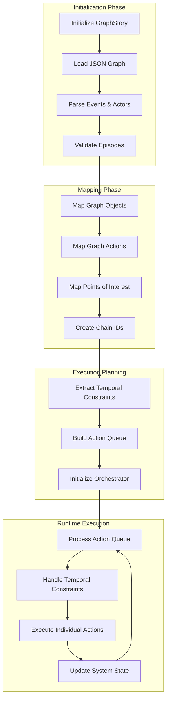
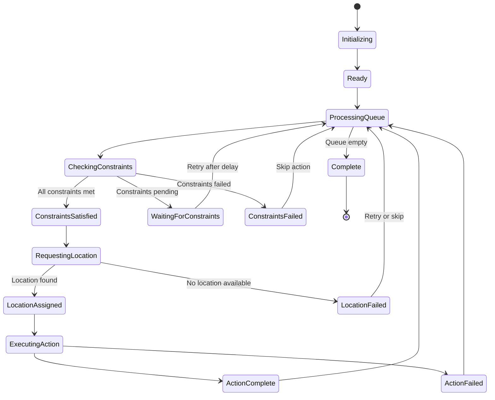
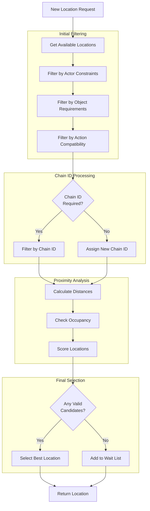
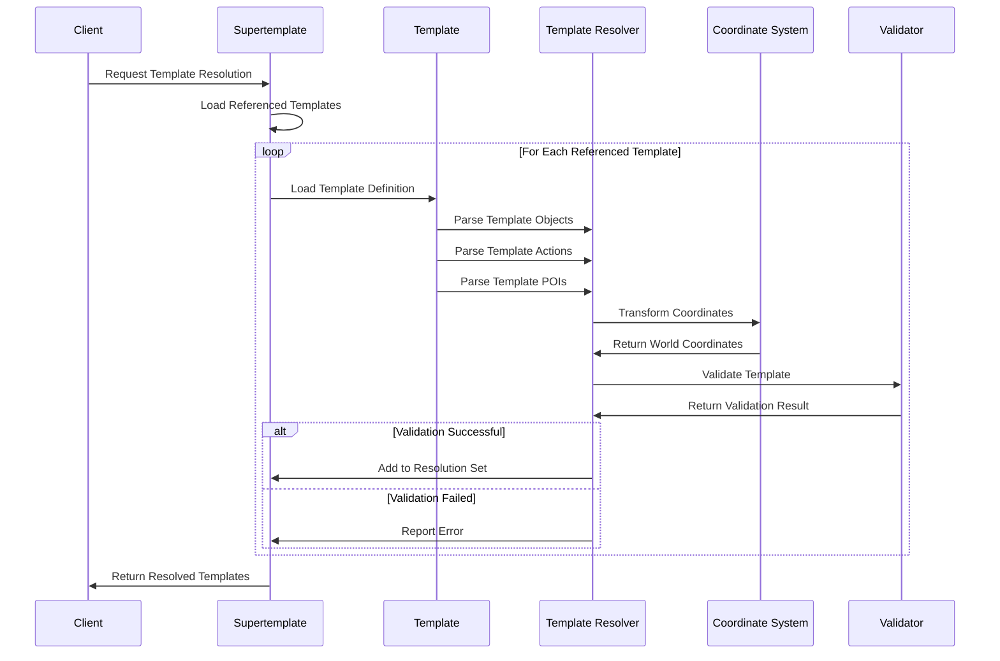
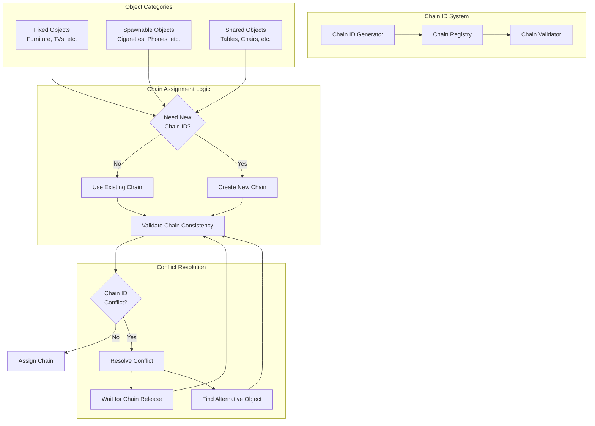
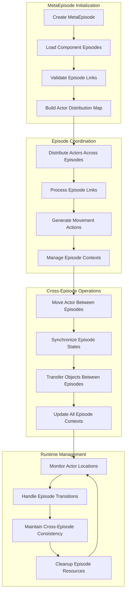
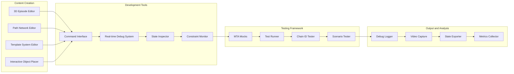
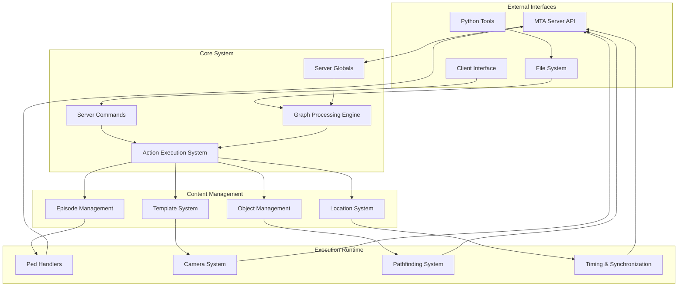

# Detailed Component Architecture

This document provides detailed architectural views of the key system components.

## GraphStory Engine Detailed Flow

## ActionsOrchestrator State Machine

## Location Manager Decision Tree

## Template Resolution Process

## Object Mapping Chain System

## MetaEpisode Management System

## Debug and Development Pipeline

## System Integration Architecture

