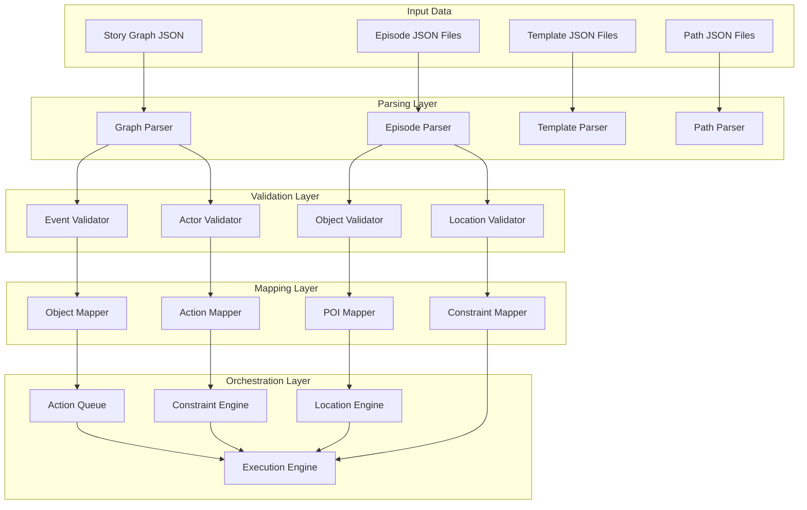
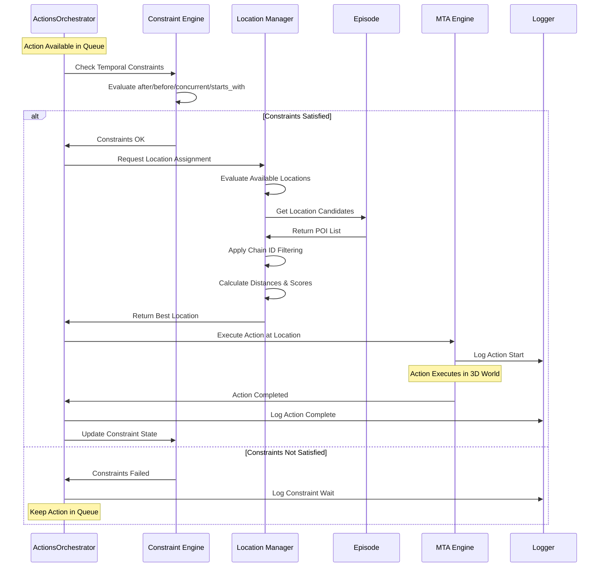
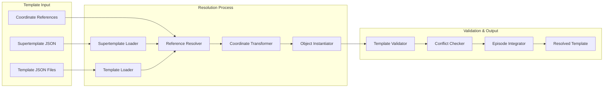
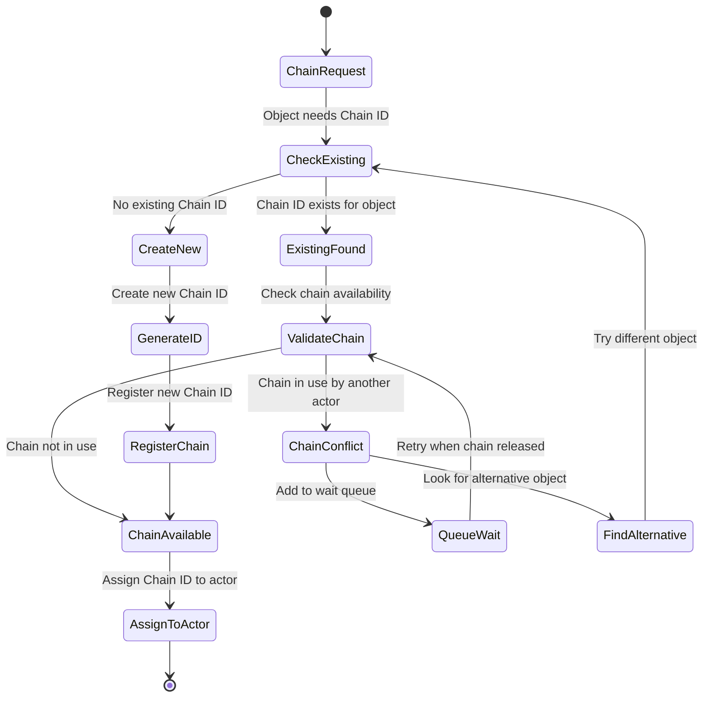
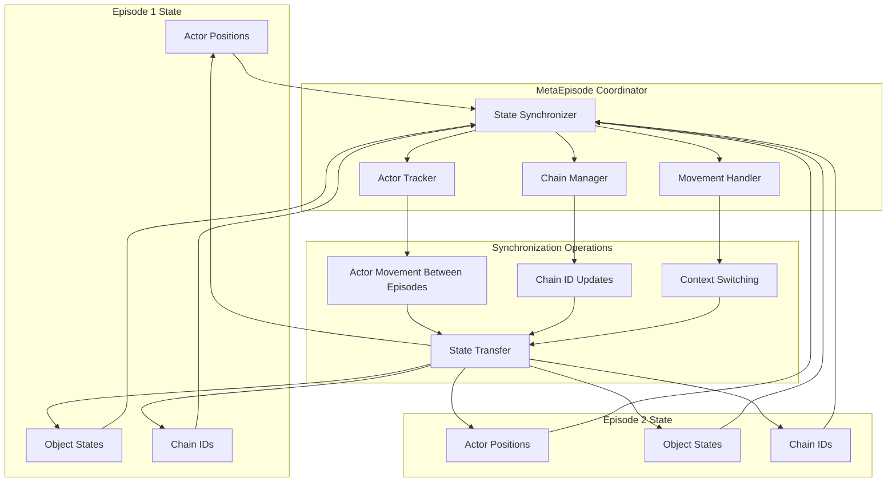
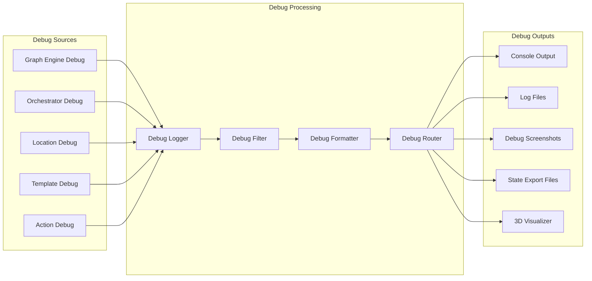
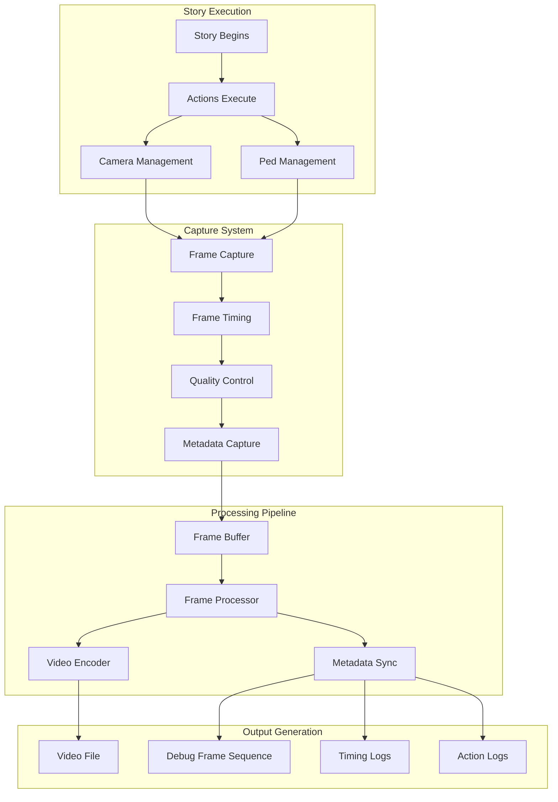
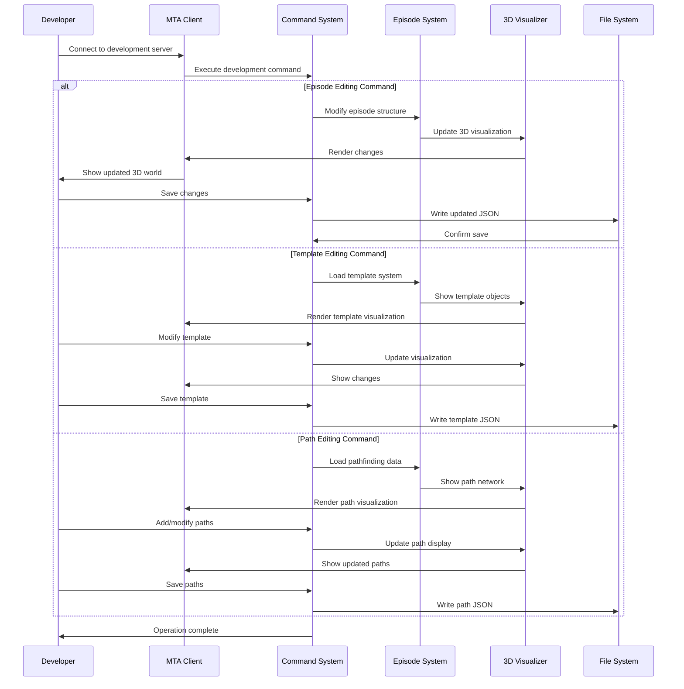
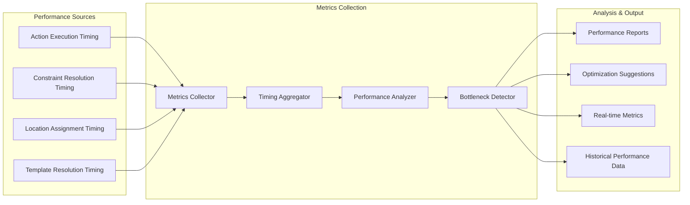

# Data Flow Architecture

This document details the data flow patterns throughout the MTA San Andreas Story Simulation System.

## Graph Processing Data Flow

## Action Execution Data Flow

## Template Resolution Data Flow

## Chain ID Management Data Flow

## Multi-Episode State Synchronization

## Debug Information Flow

## Video Generation Pipeline

## Real-time Development Data Flow

## System Performance Metrics Flow

