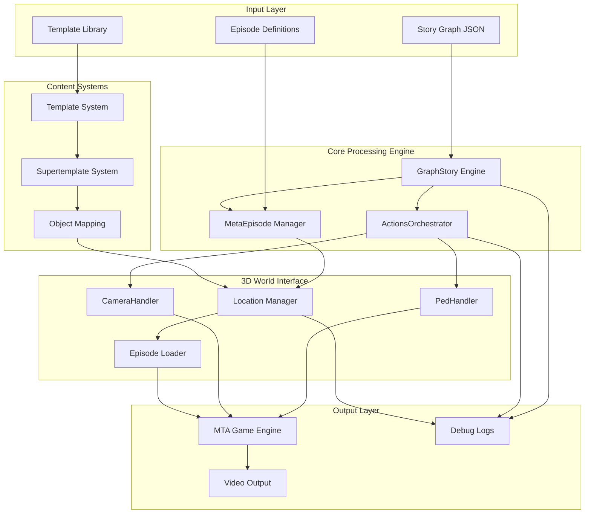
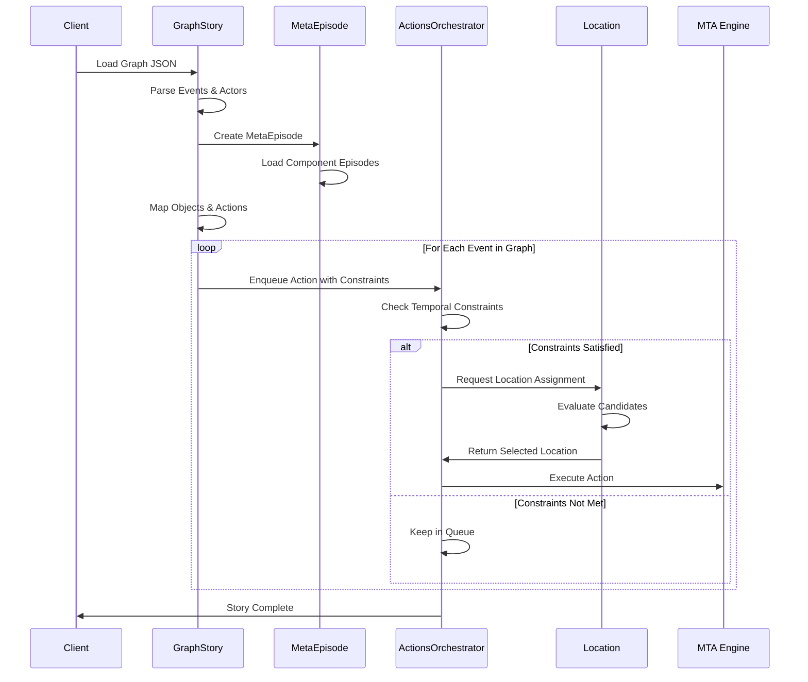
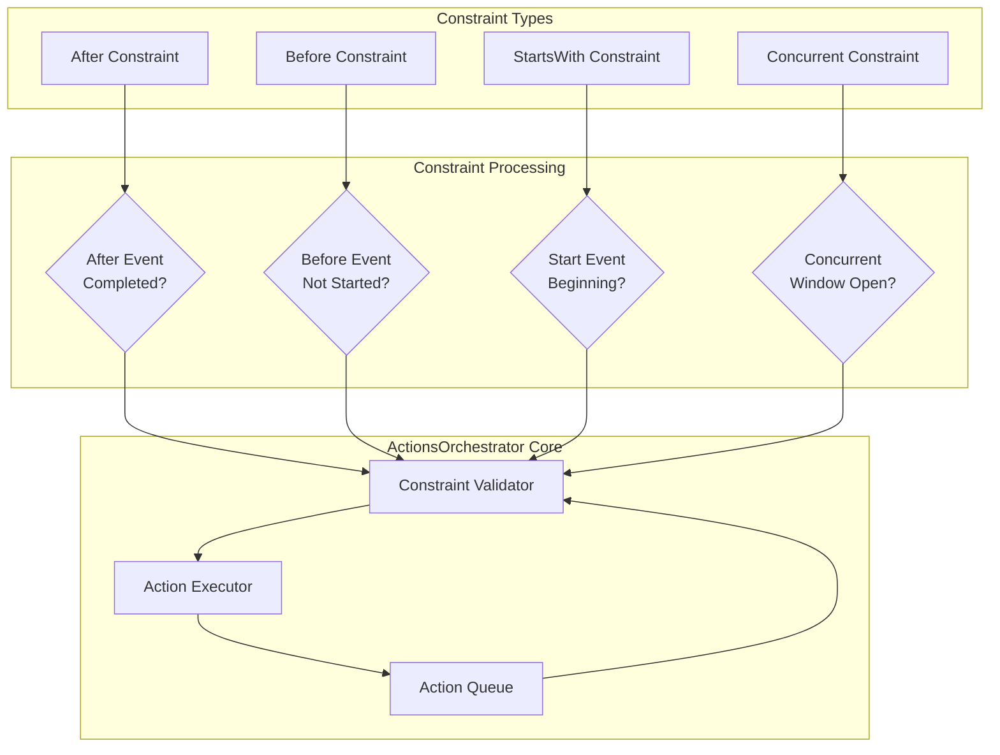
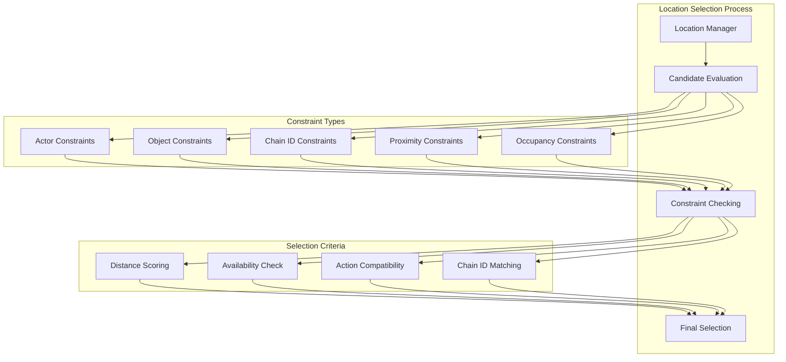
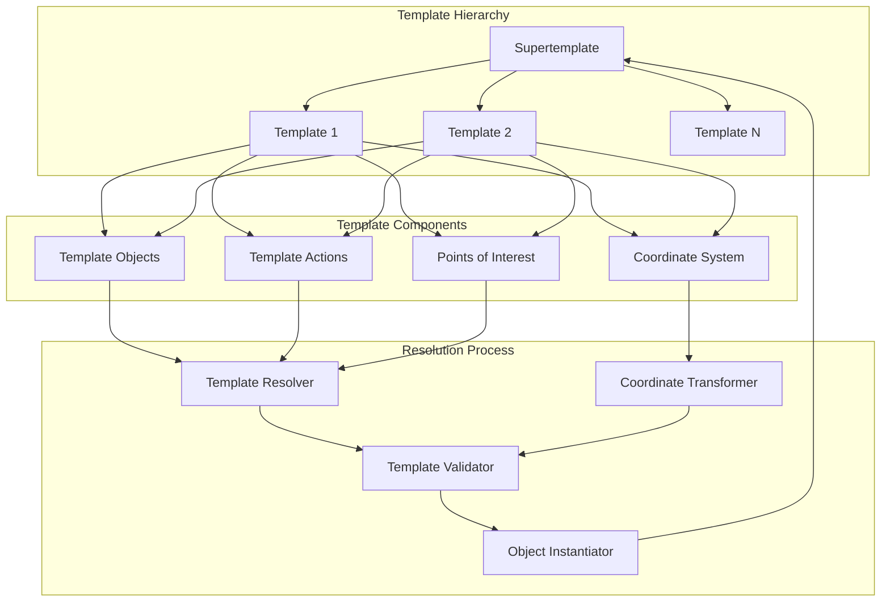
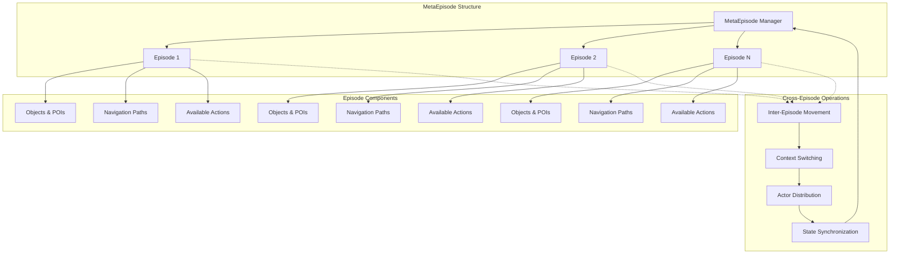
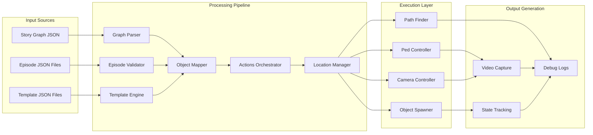
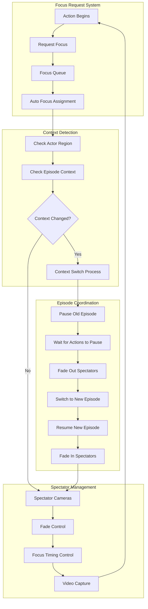
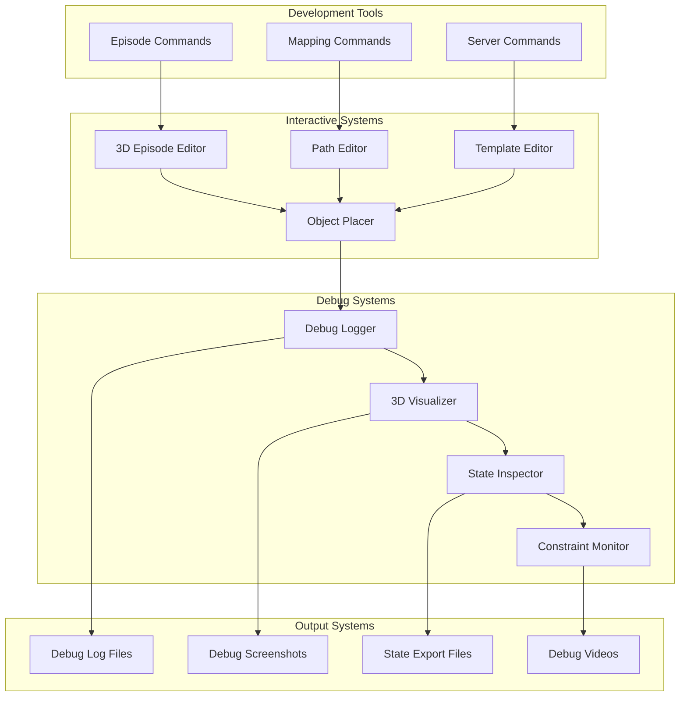

# System Architecture Overview

This document provides comprehensive architectural diagrams for the MTA San Andreas Story Simulation System using Mermaid diagrams.

## High-Level System Architecture

## Story Processing Flow

## Temporal Constraint System

## Location Management Architecture

## Template System Architecture

## Multi-Episode System

## Data Flow Architecture

## Advanced Camera Synchronization System

## Debug and Development Architecture

