# Action Planning and Execution Flow - Sequence Diagram

This diagram shows the complete flow of action planning and execution in the story system, from initial graph processing through action completion and the continuous loop.

```mermaid
sequenceDiagram
    participant GS as GraphStory
    participant Loc as Location
    participant AO as ActionsOrchestrator
    participant Player as Player (Ped)
    participant AG as ActionsGlobals
    participant EB as EventBus

    Note over GS: === INITIALIZATION ===
    GS->>GS: ProcessActions(graphActors)
    GS->>GS: MapObjectsActionsAndPoi()
    Note over GS: Creates eventObjectMap, poiMap, eventMap<br/>with chainIds for conflict resolution
    loop For Each Actor
        GS->>GS: Find starting_actions event
        GS->>GS: Resolve initial POI via poiMap
        GS->>Player: Spawn at firstLocation
        Note over Player: locationId = firstLocation.LocationId<br/>mappedChainId assigned
        GS->>GS: Store nextEvents[actorId] = firstEvent<br/>nextLocations[actorId] = firstLocation
    end

    Note over AG: === FIRST ACTION TRIGGER ===
    AG->>Loc: OnGlobalActionFinished() → GetNextValidAction(player)
    Loc->>Loc: actionsQueues[actorId] empty, call ProcessNextAction()

    Note over Loc: === ACTION PLANNING (ProcessNextAction) ===
    Loc->>Loc: Retrieve nextEvent, location, previousLocation
    Loc->>GS: GetNextEvent(event.id, actorId)
    GS-->>Loc: nextEvent
    Loc->>Loc: Mark isInteraction, extract interactionRelation

    alt Location Changed (previousLocation != location)
        Loc->>Loc: Detect entity-based Move?
        alt Move to Actor
            Note over Loc: entityType = 'actor'<br/>Move will track dynamically
        else Move to Object
            alt Object Held by Another Actor
                Note over Loc: Redirect to actor move
            else Object Not Held
                Loc->>Loc: FindPOIForObject(targetEntityId, player)
                Note over Loc: entityType = 'object'
            end
        end
        Loc->>Loc: CreateMoveAction(targetLocation, nextEvent, ...)
        Note over Loc: isArtificial = true (if not graph Move)<br/>Handle interaction POI cloning
        Loc->>Player: setData('nextTargetLocation', locationId)
        Loc->>Loc: Insert Move into actionsQueues[actorId]
    end

    alt Event is Interaction
        Loc->>Loc: Find ped1, ped2
        alt First Actor (not processed)
            Loc->>Loc: Create Wait (doNothing=false)
            Loc->>Loc: Create interaction action (Talk, Hug, etc.)
            Loc->>Loc: wait.NextAction = interactionAction
            Loc->>GS: Store interactionActionMap[relation] = action
            Loc->>GS: Mark interactionProcessedMap[relation] = true
            Loc->>Loc: Insert Wait into actionsChain
        else Second Actor (already processed)
            Loc->>Loc: Create Wait (doNothing=true)
            Note over Loc: Passive wait, no NextAction
        end
    else Non-Interaction Action
        alt Picked Object
            Loc->>Loc: Check pickedObjects[1][1] == mapped object
            Loc->>Loc: Find object in CurrentEpisode.Objects
            Loc->>Loc: InstantiateAction(event, player, location, object)
        else Spawnable Object
            Loc->>Loc: GetOrCreateSpawnableObject(event, player)
            Loc->>Loc: InstantiateAction(event, player, location, spawnable)
        else LookAt/Wave with Actor
            Loc->>Loc: Find target ped
            Loc->>Loc: InstantiateAction(event, player, location, targetActor)
        else Fallback
            Loc->>Loc: Find in location.allActions by name
        end
        Loc->>Loc: Insert eventAction into actionsChain
    end

    Note over Loc: === POI SELECTION ===
    alt POI Mapped (poiMap[nextEvent.id] exists)
        Loc->>Loc: Filter POIs by poiMap
        Loc->>Loc: Tag POIs with mappedChainId_<eventId>
        alt Actor Has Chain ID
            Loc->>Loc: Filter POIs matching player's chain
        else No Chain ID
            Loc->>Loc: Exclude chains assigned to other actors
        end
    else No Mapping
        Loc->>Loc: Filter by region, action, interactionsOnly
        Loc->>Loc: Special overrides (picked objects, LookAt, etc.)
    end

    Loc->>Loc: FilterCandidatesBySpatialConstraints(candidates)
    Note over Loc: Validates object positions against<br/>materialized objects

    alt All Candidates Busy
        Loc->>Loc: Apply chain conflict filtering
        alt Non-conflicting Found
            Loc->>Loc: Select, chainSelectionSucceeded = true
        else All Conflicting
            Loc->>Loc: Pick random busy POI
        end
    else Available Candidates
        Loc->>Loc: Apply chain conflict filtering
        alt Non-conflicting Found
            Loc->>Loc: Select, chainSelectionSucceeded = true
        else All Conflicting
            Loc->>Loc: Pick random available POI
        end
    end

    alt Chain Selection Failed & Current in Candidates
        alt Can Stay at Current
            Loc->>Loc: nextLocation = current location
        end
    end

    alt Interaction POI
        alt Mismatch with Claimed POI
            Loc->>Loc: Force correct POI
        end
        alt Should Clone for Interaction
            Loc->>Loc: Retrieve interactionOffset from stored action
            Loc->>Loc: CreateInteractionClone(nextLocation, offset)
        end
        Loc->>GS: Claim: interactionPoiMap[relation] = locationId
    end

    Loc->>Player: Assign mappedChainId from nextLocation
    Loc->>Player: setData('reservedLocationId', nextLocation.LocationId)
    Loc->>GS: SpatialCoordinator:MaterializeObject(eventObjectId, position, ...)
    Loc->>GS: Update nextEvents, nextLocations, lastLocations

    Loc->>Loc: Queue actions in actionsQueues[actorId]
    Loc-->>AG: Return {isStartingEvent = false}

    Note over AG: === ACTION RETRIEVAL ===
    AG->>Loc: GetNextValidAction(player)
    Loc->>Loc: Dequeue action from actionsQueues[actorId]
    Loc-->>AG: nextAction

    Note over AO: === ACTION ORCHESTRATION ===
    AG->>AO: EnqueueAction(action, actor, eventId)
    AO->>AO: EnqueueActionGraph(action, actor, eventId)
    AO->>GS: Retrieve lastEvents[actorId]
    AO->>AO: GetTemporalConstraints(actor, action, lastEvent)
    Note over AO: Extract after, before, starts_with, concurrent<br/>Skip starts_with for artificial actions
    AO->>AO: Store actionRequests[actorId] = {eventId, actor, action, constraints}
    AO->>AO: ProcessActionRequests()

    AO->>AO: ValidateSingularConstraints()
    Note over AO: Check if after/before events fulfilled
    AO->>AO: ValidateConcurrentConstraints()
    Note over AO: Check if all linked concurrent constraints satisfied

    alt starts_with Constraints
        loop All Linked Requests
            AO->>AO: ExecuteStartsWithRequests()
            AO->>AO: EnqueueActionLinear(action, actor, eventId)
        end
    else concurrent Constraints
        loop All Concurrent Requests
            AO->>AO: ExecuteConcurrentRequests()
            Note over AO: Shuffle order, random delay
            AO->>AO: Timer → EnqueueActionLinear(action, actor, eventId)
        end
    else Singular (Valid)
        AO->>AO: ExecuteSingularRequests()
        AO->>AO: EnqueueActionLinear(action, actor, eventId)
    end

    Note over AO: === POI QUEUE COORDINATION ===
    AO->>AO: EnqueueActionLinear(action, actor, eventId)
    alt actorLocation != requiredLocation
        AO->>AO: EnqueueForPOI(actor, action, eventId, locationId)
        AO->>Player: setData('queuedForLocationId', locationId)
        AO->>AO: ProcessPOIQueue(locationId)

        alt POI Available
            AO->>AO: first = queue[1]
            alt No Occupant or Occupant is Self
                Note over AO: Can acquire
            else Occupant Can Be Displaced
                AO->>AO: CanActorBeDisplaced(occupyingActor)
                AO->>AO: DisplaceActor(occupyingActor)
                Note over AO: Move occupant to transit POI
            else Same Interaction
                Note over AO: Allow both actors (clone)
            else Cannot Acquire
                Note over AO: Wait in queue
            end

            alt Acquired POI
                AO->>AO: Remove from queue
                AO->>Player: setData('queuedForLocationId', nil)

                alt Actor Displaced Since Queueing
                    AO->>Loc: Find corrective Move action
                    AO->>GS: Insert into actionsQueues[actorId]
                    AO->>Player: Apply Move (original action queued)
                    Note over Player: Original action executes after Move
                else Already at Correct Location
                    AO->>AO: TriggerActionExecution(actor, action, eventId)
                end

                AO->>AO: ProcessPOIQueue(locationId) (next in queue)
            end
        end
    else Direct Execution
        AO->>AO: TriggerActionExecution(actor, action, eventId)
    end

    Note over AO: === EXECUTION TRIGGER ===
    AO->>AO: TriggerActionExecution(actor, action, eventId)
    alt Not Artificial
        AO->>Player: setData('currentGraphEventId', eventId)
    end

    alt Context Switch Needed
        AO->>Player: setData('isAwaitingContextSwitch', true)
        AO->>AO: Store in actionQueue[actorId]
        AO->>AO: CameraHandler:requestFocus(actorId)
        Note over AO: Wait for context switch...
        AO->>AO: (Later) TriggerActionFromQueue(actor)
        AO->>Player: setData('isAwaitingContextSwitch', false)
    end

    AO->>AO: PublishActionStarted(actor, action, eventId)
    alt Not Artificial & Name Matches Expected
        AO->>EB: publish('graph_event_start', {eventId, actorId, actionName})
    end
    AO->>Player: action:Apply()

    Note over Player: === ACTION EXECUTION ===
    Player->>Player: Execute action logic (animation, movement, etc.)
    Player->>AG: OnGlobalActionFinished(delay, playerId, storyId, callback)

    Note over AG: === ACTION COMPLETION ===
    AG->>AG: Timer(delay) fires
    alt Callback Provided
        AG->>AG: Execute callback (e.g., preserve animation state)
    end

    AG->>Player: Retrieve completedEventId = getData('currentGraphEventId')
    AG->>AG: Preserve eventIdForNextAction = completedEventId

    alt Graph Event & Action Matches Expected
        AG->>EB: publish('graph_event_end', {eventId, actorId, actionName})
    end
    AG->>Player: setData('currentGraphEventId', nil)

    alt requestPause
        AG->>Player: setData('paused', true)
        AG->>AO: CameraHandler:requestFocus(actorId)
        Note over AG: Stop processing
    end

    alt No Last Action
        AG->>Loc: POI[startingPoiIdx]:GetNextValidAction(actor)
        Loc-->>AG: firstAction
    else Linear Story with NextAction
        AG->>AG: nextAction = lastAction.NextAction
        Note over AG: isNextActionFromChain = true
    else Graph Story
        AG->>Loc: lastAction.NextLocation:GetNextValidAction(actor)
        Note over Loc: Triggers ProcessNextAction() again
        Loc-->>AG: nextAction
    end

    alt NextAction from Chain
        AG->>AO: EnqueueAction(nextAction, actor, eventIdForNextAction)
        Note over AG: Preserve eventId for NextAction inheritance
    else Normal Flow
        AG->>AO: EnqueueAction(nextAction, actor)
        Note over AO: Lookup eventId from lastEvents
    end

    Note over GS: === LOOP CONTINUES ===
    Note over AO,AG: Repeat orchestration → execution → completion cycle<br/>until all actors complete their event chains
```

## Key Components

### GraphStory
- Initializes story, maps objects/POIs to simulator instances
- Creates chain IDs for conflict resolution
- Maintains interactionPoiMap and interactionProcessedMap

### Location
- Plans next actions for actors
- Selects appropriate POIs based on candidates, chains, conflicts
- Creates artificial Move actions when location changes
- Handles interaction Wait action creation
- Manages action queues per actor

### ActionsOrchestrator
- Validates temporal constraints (after, before, starts_with, concurrent)
- Coordinates POI access through queue system
- Handles displacement when actors conflict
- Manages context switches between episodes
- Triggers action execution

### Player (Ped)
- Executes actions (animations, movements, etc.)
- Stores location, chain, and event data
- Triggers OnGlobalActionFinished when complete

### ActionsGlobals
- Handles action completion callbacks
- Publishes graph_event_end to EventBus
- Retrieves next action and loops back to orchestrator

### EventBus
- Receives graph_event_start and graph_event_end events
- Used by camera system and logging

## Critical Flow Points

1. **Interaction Synchronization**: First actor claims POI, second actor receives cloned offset POI
2. **POI Queue System**: Only Move actions go through queue (they have NextLocation)
3. **Artificial Moves**: Skip temporal constraints but still go through POI queue
4. **Chain System**: Prevents conflicts when multiple POIs/objects match graph requirements
5. **Context Switches**: Actors wait in actionQueue for camera to switch episodes before executing
